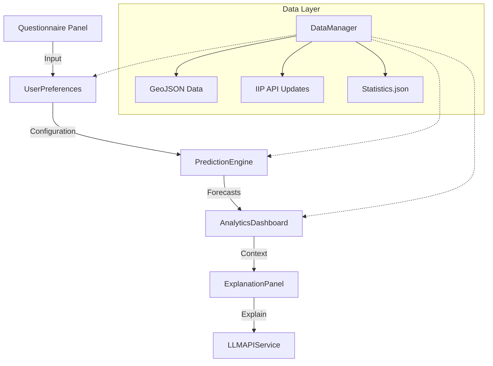

# 🗺️ Bản đồ Khu Công Nghiệp/Cụm Công Nghiệp Việt Nam

Ứng dụng bản đồ tương tác hiển thị các Khu Công Nghiệp (KCN) và Cụm Công Nghiệp (CCN) trên toàn lãnh thổ Việt Nam, tích hợp tìm kiếm thông minh, tìm đường đa phương tiện, và hiển thị các địa điểm quan trọng.

## 📋 Mục lục

- [Tính năng chính](#-tính-năng-chính)
- [Công nghệ sử dụng](#-công-nghệ-sử-dụng)
- [Cấu trúc dự án](#-cấu-trúc-dự-án)
- [Cài đặt](#-cài-đặt)
- [Sử dụng](#-sử-dụng)
- [Dữ liệu](#-dữ-liệu)
- [Tính năng chi tiết](#-tính-năng-chi-tiết)
- [Scripts Python](#-scripts-python)
- [Tối ưu hóa](#-tối-ưu-hóa)

## ✨ Tính năng chính

### 🏭 Hiển thị Khu Công Nghiệp/Cụm Công Nghiệp
- **1000+ KCN/CCN** trên toàn quốc
- Thông tin chi tiết: tên, địa chỉ, diện tích, giá thuê
- Markers tùy chỉnh với màu sắc phân biệt (KCN: cam, CCN: xanh)
- Batch rendering (50 markers/lần) để tránh lag
- Dynamic sizing theo zoom level
- Click để xem thông tin chi tiết và link Google Maps

### 🔍 Tìm kiếm thông minh
- **Multi-field search**: Tìm theo tên, mã, địa chỉ, tỉnh, huyện, xã
- **Fuzzy word matching**: Tìm được ngay cả khi gõ sai từ
- **Scoring system**: Ưu tiên kết quả chính xác nhất
- **3 nguồn dữ liệu**: KCN/CCN, Địa điểm quan trọng, OpenStreetMap
- **Google Maps style**: Dropdown suggestions với icons
- **20 kết quả** hiển thị với thông tin phụ (tỉnh, diện tích)

### 🎯 Tìm trong bán kính
- Tìm tất cả KCN/CCN và địa điểm quan trọng trong bán kính tùy chỉnh
- Tìm quanh vị trí tìm kiếm hoặc KCN/CCN đã chọn
- Hiển thị khoảng cách chính xác
- Sắp xếp theo khoảng cách
- Icons phân biệt loại địa điểm

### 🗺️ Địa điểm quan trọng
- **114 Cảng biển** ⚓
- **44 Sân bay** ✈️
- **63 Trung tâm tỉnh thành** 🏙️
- Batch rendering để tối ưu hiệu suất
- Dynamic marker sizing
- Toggle on/off từng loại

### 📍 GPS/Định vị người dùng
- **Xác định vị trí hiện tại** - Sử dụng GPS/Geolocation API
- **Nút GPS** - Nút "Vị trí của tôi" ở góc bản đồ
- **Marker vị trí người dùng** - Hiển thị với animation pulse
- **Độ chính xác GPS** - Hiển thị vòng tròn accuracy
- **Tìm KCN/CCN gần tôi** - Tìm các khu công nghiệp gần vị trí hiện tại
- **Tích hợp routing** - Dùng vị trí hiện tại làm điểm xuất phát
- **Tự động zoom** - Bay đến vị trí người dùng khi bật GPS

### 🚗 Tìm đường đa phương tiện
- **4 phương tiện**:
  - 🚗 Ô tô (có tính traffic)
  - 🏍️ Xe máy
  - 🚴 Xe đạp
  - 🚶 Đi bộ
- Thêm nhiều điểm dừng (waypoints)
- Hiển thị chi tiết từng bước
- Thông tin: khoảng cách, thời gian, hướng dẫn rẽ
- Lưu lịch sử tìm đường
- Xuất route ra GeoJSON

### 🗂️ Quản lý lớp bản đồ
- Toggle hiển thị/ẩn từng lớp
- Lưu trạng thái vào localStorage
- Đếm số lượng features
- 2 nền bản đồ: Satellite và Streets
- Hiển thị ranh giới 34 tỉnh thành
- Hiển thị vùng biển Hoàng Sa, Trường Sa

### 🎨 Bộ lọc mức độ phát triển tỉnh thành
- **Phân loại 3 mức độ**:
  - 🔴 **Phát triển** (12 tỉnh trụ cột): Hà Nội, TP.HCM, Bình Dương, Đồng Nai...
  - 🟠 **Đang phát triển** (21 tỉnh tăng trưởng cao): Bắc Giang, Thanh Hóa, Nghệ An...
  - 🟡 **Chưa phát triển** (24 tỉnh tiềm năng): Cao Bằng, Lào Cai, Đắk Lắk...
- **Toggle độc lập**: Bật/tắt từng nhóm tỉnh
- **8 tổ hợp lọc**: Hỗ trợ tất cả các tổ hợp (all on, all off, partial)
- **Filter persistence**: Duy trì trạng thái qua zoom, pan, style changes
- **Performance**: Cập nhật < 60ms (debounced 50ms)
- **Legend tích hợp**: Hiển thị chú thích màu sắc và icon địa điểm quan trọng

## 🛠️ Công nghệ sử dụng

### Frontend
- **Mapbox GL JS v3.1.2** - Bản đồ tương tác
- **Vanilla JavaScript** - ES6 Modules
- **Lucide Icons** - Icon library
- **HTML5/CSS3** - UI/UX

### Backend/Data Processing
- **Python 3.12+** - Scripts xử lý dữ liệu
- **Requests** - HTTP client
- **Mapbox Geocoding API** - Geocoding

### APIs
- **Mapbox Directions API** - Tìm đường
- **Mapbox Geocoding API** - Tìm kiếm địa điểm
- **Nominatim (OpenStreetMap)** - Tìm kiếm bổ sung
- **IIP Vietnam API** - Dữ liệu KCN/CCN

## 📁 Cấu trúc dự án

```
MapBox-fixed/
├── data/                           # Dữ liệu GeoJSON
│   ├── industrial_zones.geojson    # KCN/CCN (1000+)
│   ├── provinces_34_user.geojson   # Ranh giới tỉnh thành
│   ├── 34-tinh-thanh-trung-tam.geojson  # Trung tâm 63 tỉnh thành
│   ├── cangbienexport.geojson      # 114 cảng biển
│   ├── export.geojson              # 44 sân bay
│   └── ...
│
├── src/
│   ├── routing/                    # Module tìm đường
│   │   ├── components/             # UI components
│   │   │   ├── route-panel.js      # Panel nhập điểm
│   │   │   ├── route-info-panel.js # Hiển thị thông tin
│   │   │   └── map-route-renderer.js # Vẽ route
│   │   ├── managers/               # Business logic
│   │   │   ├── route-manager.js    # Quản lý routes
│   │   │   ├── waypoint-manager.js # Quản lý waypoints
│   │   │   ├── history-manager.js  # Lịch sử
│   │   │   └── route-exporter.js   # Xuất GeoJSON
│   │   ├── services/
│   │   │   └── directions-api.js   # Mapbox API
│   │   ├── styles/
│   │   │   └── routing.css
│   │   └── types/
│   │       └── index.js            # TypeScript definitions
│   │
│   └── strategic-locations/        # Module địa điểm quan trọng
│       ├── components/
│       │   └── map-location-renderer.js  # Render markers
│       ├── managers/
│       │   ├── location-manager.js       # Quản lý locations
│       │   └── layer-manager.js          # Quản lý layers
│       ├── utils/
│       │   ├── geojson-validator.js      # Validate GeoJSON
│       │   └── icon-registry.js          # Icon mapping
│       └── styles/
│           └── strategic-locations.css
│
├── vendor/                         # Third-party libraries
│   ├── mapbox-gl-draw.js
│   ├── mapbox-gl-geocoder.min.js
│   └── ...
│
├── interactive_satellite_map.html  # Main application
├── fetch_iip_data.py              # Fetch data từ IIP API
├── build_industrial_geojson.py    # Build GeoJSON từ nhiều nguồn
└── README.md                      # Documentation
```

## 🚀 Cài đặt

### Yêu cầu
- **Web Server** (Python, Node.js, hoặc bất kỳ)
- **Mapbox Access Token** (miễn phí tại [mapbox.com](https://mapbox.com))
- **Python 3.12+** (nếu cần chạy scripts)

### Bước 1: Clone repository
```bash
git clone <repository-url>
cd MapBox-fixed
```

### Bước 2: Cấu hình Mapbox Token
Mở `interactive_satellite_map.html` và thay thế token:
```javascript
const MAPBOX_TOKEN = 'YOUR_MAPBOX_TOKEN_HERE';
```

### Bước 3: Chạy web server
**Python:**
```bash
python -m http.server 8000
```

**Node.js:**
```bash
npx http-server -p 8000
```

**Hoặc dùng file batch có sẵn:**
```bash
start-server.bat
```

### Bước 4: Mở trình duyệt
```
http://localhost:8000/interactive_satellite_map.html
```

## 📖 Sử dụng

### Tìm kiếm KCN/CCN
1. Click vào **Menu** (góc trên trái)
2. Chọn tab **Tìm kiếm**
3. Gõ tên KCN/CCN, tỉnh, hoặc huyện
4. Chọn kết quả từ dropdown

**Ví dụ:**
- "VSIP" → Tìm tất cả VSIP
- "Bắc Ninh" → Tìm tất cả KCN ở Bắc Ninh
- "Lan Sơn 2" → Tìm Cụm CN Lan Sơn 2

### Tìm trong bán kính
1. Tìm một địa điểm hoặc chọn KCN/CCN
2. Nhập bán kính (km)
3. Click **"Tìm quanh vị trí tìm kiếm"** hoặc **"Tìm quanh KCN/CCN đã chọn"**
4. Xem danh sách kết quả với khoảng cách

### Tìm đường
1. Click **Menu** → Tab **Tìm đường**
2. Chọn phương tiện (🚗 🏍️ 🚴 🚶)
3. Nhập điểm đi và điểm đến
4. (Tùy chọn) Thêm điểm dừng
5. Click **"Tìm đường"**
6. Xem thông tin chi tiết bên phải

### Quản lý lớp bản đồ
1. Click **Menu** → Tab **Lớp bản đồ**
2. Toggle **KCN/CCN** để hiển thị/ẩn
3. Toggle **Địa điểm quan trọng** để hiển thị/ẩn
4. Toggle **Lớp tỉnh thành** để hiển thị/ẩn ranh giới
5. Chuyển đổi **Nền bản đồ** (Satellite/Streets)

### Bộ lọc mức độ phát triển
1. Bật **Lớp tỉnh thành** (nếu chưa bật)
2. Trong tab **Lớp bản đồ**, tìm phần **"Lọc theo mức độ phát triển"**
3. Click vào các nút để toggle:
   - 🔴 **Phát triển** - Các tỉnh công nghiệp trụ cột
   - 🟠 **Đang phát triển** - Các tỉnh tăng trưởng cao
   - 🟡 **Chưa phát triển** - Các tỉnh tiềm năng sơ khởi
4. Xem legend ở góc dưới bên trái để biết ý nghĩa màu sắc
5. Tổ hợp bất kỳ: Có thể bật/tắt từng nhóm độc lập

**Ví dụ:**
- Chỉ xem tỉnh phát triển: Tắt 🟠 và 🟡
- Xem tỉnh đang và chưa phát triển: Tắt 🔴
- Ẩn tất cả: Tắt cả 3 nút

### Sử dụng GPS/Định vị
1. Click nút **GPS** (📍) ở góc phải bản đồ
2. Cho phép trình duyệt truy cập vị trí
3. Bản đồ sẽ tự động bay đến vị trí của bạn
4. Click **"Tìm KCN/CCN gần tôi"** để tìm các khu công nghiệp gần nhất
5. Sử dụng vị trí hiện tại làm điểm xuất phát cho tìm đường

## 📊 Dữ liệu

### Nguồn dữ liệu

| Loại | Số lượng | Nguồn | File |
|------|----------|-------|------|
| KCN/CCN | 1000+ | IIP Vietnam API | `industrial_zones.geojson` |
| Cảng biển | 114 | OpenStreetMap | `cangbienexport.geojson` |
| Sân bay | 44 | OpenStreetMap | `export.geojson` |
| Trung tâm TP | 63 | Manual | `34-tinh-thanh-trung-tam.geojson` |
| Tỉnh thành | 34 | GADM | `provinces_34_user.geojson` |

### Cấu trúc dữ liệu KCN/CCN

```json
{
  "type": "Feature",
  "geometry": {
    "type": "Point",
    "coordinates": [105.74198, 21.07554]
  },
  "properties": {
    "name": "KHU CÔNG VIÊN CÔNG NGHỆ SỐ VÀ HỖN HỢP - HÀ NỘI",
    "code": "khu-cong-vien-cong-nghe-so-va-hon-hop-ha-noi",
    "address": "phường Tây Tựu, phường Phú Diễn, thành phố Hà Nội",
    "province": "Hà Nội",
    "district": "Bắc Từ Liêm",
    "acreage": 196.8,
    "price": "350",
    "kind": "KCN/CCN",
    "source": "api.iipvietnam.vn"
  }
}
```

## 🎯 Tính năng chi tiết

### Bộ lọc mức độ phát triển tỉnh thành

#### Phân loại tỉnh thành

**Tỉnh công nghiệp phát triển (12 tỉnh - Trụ cột):**
- Hà Nội, Hải Phòng, Bắc Ninh, Quảng Ninh, Vĩnh Phúc
- Đà Nẵng, Khánh Hòa
- TP. Hồ Chí Minh, Bình Dương, Đồng Nai, Bà Rịa - Vũng Tàu, Long An

**Tỉnh đang phát triển (21 tỉnh - Tốc độ tăng trưởng cao):**
- Miền Bắc: Bắc Giang, Thái Nguyên, Phú Thọ, Nam Định, Ninh Bình, Hà Nam, Hải Dương, Hưng Yên
- Miền Trung: Thanh Hóa, Hà Tĩnh, Nghệ An, Quảng Trị, Thừa Thiên Huế, Quảng Ngãi, Quảng Nam
- Miền Nam: Tây Ninh, Tiền Giang, Cần Thơ, Bình Phước, Đồng Tháp

**Tỉnh chưa phát triển (24 tỉnh - Tiềm năng sơ khởi):**
- Miền Bắc: Cao Bằng, Bắc Kạn, Hà Giang, Lào Cai, Lai Châu, Điện Biên, Sơn La, Yên Bái, Tuyên Quang, Lạng Sơn
- Tây Nguyên: Kon Tum, Đắk Nông, Gia Lai, Đắk Lắk, Lâm Đồng
- Miền Nam: Ninh Thuận, Bình Thuận, An Giang, Bạc Liêu, Cà Mau, Kiên Giang, Sóc Trăng, Trà Vinh, Vĩnh Long

#### Cách hoạt động

**Filter State Manager:**
```javascript
class ProvinceFilterState {
  filters = {
    developed: true,      // Mặc định: hiển thị
    developing: true,
    underdeveloped: true
  }
}
```

**Filter Expression Builder:**
- All filters ON → Return `true` (hiển thị tất cả)
- All filters OFF → Return `['==', ['get', 'display_name'], '']` (ẩn tất cả)
- Partial → Return `['in', ['get', 'display_name'], ['literal', [...]]]`

**Performance:**
- Debounce: 50ms (tránh lag khi click nhanh)
- RequestAnimationFrame: Sync với browser repaint
- Update time: ~60ms (< 300ms requirement)

**Edge Cases:**
- Province layer chưa load → Skip gracefully
- Null filter state → Show all (safe default)
- Missing classification data → Log warning, skip
- Province name mismatch → Normalize names
- Map not ready → Wait until ready

#### UI Components

**Filter Buttons:**
- 🔴 Red (#B91C1C) - Phát triển
- 🟠 Orange (#F97316) - Đang phát triển
- 🟡 Yellow (#FDE047) - Chưa phát triển

**Status Icons:**
- ✓ - Filter active (hiển thị)
- ✗ - Filter inactive (ẩn)

**Legend:**
- Vị trí: Góc dưới bên trái
- Hiển thị: Khi lớp tỉnh thành được bật
- Nội dung: Màu sắc + Icon địa điểm quan trọng

### Tìm kiếm thông minh

#### Multi-field Search
Tìm kiếm trong 7 trường:
1. **Name** (tên) - Ưu tiên cao nhất
2. **Code** (mã)
3. **Address** (địa chỉ)
4. **Province** (tỉnh)
5. **District** (huyện)
6. **Commune** (xã)
7. **Kind** (loại)

#### Scoring System
```
Exact match:        100 điểm
Starts with:         90 điểm
Contains:            80 điểm
Fuzzy word match:    75 điểm
Code match:          70 điểm
Province:            60 điểm
District:            50 điểm
Address:             40 điểm
Address fuzzy:       35 điểm
Commune:             30 điểm
Kind:                20 điểm
```

#### Fuzzy Word Matching
- Tách query thành các từ riêng lẻ
- Kiểm tra tất cả các từ có xuất hiện không
- Không cần khớp chính xác thứ tự

**Ví dụ:**
- Query: "Khu công nghiệp Lan Sơn"
- Match: "CỤM CÔNG NGHIỆP LAN SƠN 2" ✅
- Lý do: Tất cả từ "cong", "nghiep", "lan", "son" đều có

### Batch Rendering

Để tránh browser bị treo khi tạo 1000+ markers:

```javascript
const BATCH_SIZE = 50; // Tạo 50 markers mỗi lần

function createMarkerBatch() {
  // Tạo batch hiện tại
  for (let i = start; i < end; i++) {
    createMarker(features[i]);
  }
  
  // Tiếp tục batch tiếp theo
  if (end < features.length) {
    setTimeout(createMarkerBatch, 0); // Yield to UI thread
  }
}
```

### Dynamic Marker Sizing

Markers thay đổi kích thước theo zoom level:

| Zoom Level | Marker Size | Icon Size | Border |
|------------|-------------|-----------|--------|
| < 8 | 24px | 14px | 2px |
| 8-10 | 32px | 18px | 3px |
| > 10 | 40px | 22px | 3px |

### Layer Management

Trạng thái layers được lưu vào localStorage:

```javascript
{
  "industrial-zones": false,      // Ẩn mặc định
  "strategic-locations": false,   // Ẩn mặc định
  "provinces": true               // Hiện mặc định
}
```

## 🐍 Scripts Python

### 1. `fetch_iip_data.py`

Fetch dữ liệu KCN/CCN từ IIP Vietnam API.

**Chạy:**
```bash
python fetch_iip_data.py
```

**Output:**
- `data/industrial_zones.geojson` - GeoJSON đã xử lý
- `data/industrial_zones_iip_raw.json` - Raw data

**Tính năng:**
- Fetch từ API
- Chuyển đổi sang GeoJSON
- Normalize tên tỉnh/huyện
- Validate coordinates

### 2. `build_industrial_geojson.py`

Build GeoJSON từ nhiều nguồn (Excel, JSONL, JSON).

**Chạy:**
```bash
python build_industrial_geojson.py --output data/industrial_zones.geojson
```

**Options:**
```bash
--output PATH       # Output GeoJSON path
--cache PATH        # Geocoding cache
--excel-coords PATH # Excel file với Lat/Lng
--delay FLOAT       # Delay giữa geocoding requests
```

**Tính năng:**
- Đọc từ nhiều nguồn
- Geocoding tự động (Mapbox)
- Cache để tránh re-geocoding
- Merge duplicates
- Validate và clean data

## ⚡ Tối ưu hóa

### Performance

1. **Batch Rendering**: 50 markers/lần
2. **Lazy Loading**: Chỉ load khi cần
3. **Debounced Search**: 250ms delay
4. **Dynamic LOD**: Ẩn markers khi zoom xa
5. **LocalStorage**: Cache layer states

### Search Optimization

1. **Multi-field indexing**: Tìm trong 7 trường
2. **Fuzzy matching**: Tìm được cả khi sai chính tả
3. **Scoring**: Ưu tiên kết quả tốt nhất
4. **Limit results**: 20 kết quả tối đa

### Memory Management

1. **Reuse markers**: Không tạo lại khi toggle
2. **Remove old popups**: Chỉ 1 popup tại 1 thời điểm
3. **Clean up listeners**: Remove khi không dùng

## 📝 Ghi chú

### Mapbox Token
- Token hiện tại là **public token**
- Nên tạo token riêng tại [mapbox.com](https://account.mapbox.com/access-tokens/)
- Free tier: 50,000 requests/tháng

### Browser Support
- Chrome/Edge: ✅ Tốt nhất (hỗ trợ đầy đủ GPS)
- Firefox: ✅ Tốt (hỗ trợ GPS)
- Safari: ✅ Tốt (hỗ trợ GPS)
- IE11: ❌ Không hỗ trợ

### GPS/Geolocation
- Yêu cầu **HTTPS** hoặc **localhost** để hoạt động
- Cần cho phép truy cập vị trí trong trình duyệt
- Độ chính xác phụ thuộc vào thiết bị và môi trường
- Hoạt động tốt nhất trên thiết bị di động có GPS

### Known Issues
- Một số KCN/CCN có tọa độ không chính xác
- Geocoding có thể sai với địa chỉ mơ hồ
- Traffic data chỉ có ở các thành phố lớn
- GPS có thể không chính xác trong nhà hoặc khu vực có nhiều tòa nhà cao tầng
- Một số tên tỉnh trong GeoJSON có thể không khớp hoàn toàn với classification data (đã normalize)

## 🤝 Đóng góp

Contributions are welcome! Please:
1. Fork repository
2. Create feature branch
3. Commit changes
4. Push to branch
5. Create Pull Request

## 📄 License

MIT License - Xem file LICENSE để biết thêm chi tiết.

## 👥 Tác giả

- **Developer**: [Nguyễn Đức Toàn]
- **Data Source**: IIP Vietnam, OpenStreetMap
- **Map Provider**: Mapbox

## 🔗 Links

- [Mapbox Documentation](https://docs.mapbox.com/)
- [IIP Vietnam](https://iipvietnam.vn/)
- [OpenStreetMap](https://www.openstreetmap.org/)

---

**Phiên bản**: 2.2  
**Cập nhật**: 2026-02-25  
**Status**: ✅ Production Ready

**Tính năng mới v2.2:**
- 🎨 Bộ lọc mức độ phát triển tỉnh thành - Phân loại 34 tỉnh thành theo 3 mức độ
- 🔴🟠🟡 Toggle độc lập cho từng nhóm tỉnh
- 📊 Legend tích hợp với icon địa điểm quan trọng
- ⚡ Performance optimization với debouncing (50ms)
- 🛡️ Comprehensive edge case handling

**Tính năng v2.1:**
- 📍 GPS/Geolocation - Xác định vị trí người dùng
- 🎯 Tìm KCN/CCN gần tôi - Tìm kiếm dựa trên vị trí hiện tại
- 🗺️ Tích hợp routing với GPS - Dùng vị trí hiện tại làm điểm xuất phát

---

## 🤖 AI Investment Advisor (v3.0)

Hệ thống hỗ trợ tư vấn đầu tư thông minh tích hợp AI, giúp nhà đầu tư tìm kiếm vị trí tối ưu dựa trên hồ sơ rủi ro, ngân sách và yêu cầu hạ tầng.

### 🧩 Kiến trúc hệ thống



### 🌟 Tính năng AI nổi bật

1.  **Dự báo xu hướng (Prediction Engine)**: 
    *   Sử dụng các phương pháp thống kê (Linear Regression, Moving Average) để dự báo giá thuê và tốc độ lấp đầy trong 12-24 tháng tới.
    *   Tính toán chỉ số tiềm năng tăng trưởng (Growth Potential Score) dựa trên 15+ tham số.
2.  **Dashboard Phân tích (Analytics Dashboard)**:
    *   Trực quan hóa dữ liệu thời gian thực cho từng khu vực.
    *   So sánh đa tiêu chí giữa các tỉnh thành và khu công nghiệp.
3.  **Giải thích bằng AI (Explanation Panel)**:
    *   Tích hợp LLM (Gemini/GPT) để giải thích các quyết định của hệ thống bằng ngôn ngữ tự nhiên.
    *   Hỗ trợ đa ngôn ngữ (Tiếng Việt/Tiếng Anh).
4.  **Cá nhân hóa (User Profiles)**:
    *   Lưu trữ nhiều hồ sơ đầu tư khác nhau (Sản xuất, Logistics, Công nghệ cao).
    *   Tự động gợi ý dựa trên lịch sử tìm kiếm.

### 🛠️ Cài đặt Module AI

Module AI yêu cầu cấu hình API Key cho LLM trong file `.env`:

```bash
LLM_API_KEY=your_api_key_here
LLM_PROVIDER=google # hoặc openai
```

Chạy script cập nhật dữ liệu hàng tháng:
```bash
python scripts/update_industrial_stats.py
```

**Phiên bản**: 3.0  
**Cập nhật**: 2026-05-06  
**Status**: 🚀 AI Integration Live
